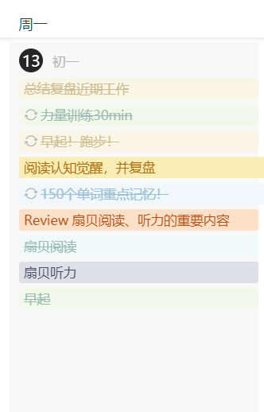
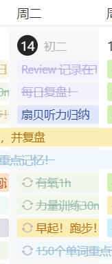
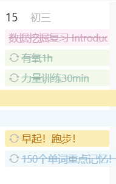

## 11/13

最重要的事情应该是回宝贝消息！！！

我好想我家宝贝啊...

今天事项：

早上雀食早起了。六点钟，但是好冷好暗，就又睡觉去了。

醒来就是九点半，然后开始刷手机。

啊啊啊啊不能刷短视频！！！

以后每刷一次短视频打自己脸一次，直到戒掉这个习惯为止！！！

用别的习惯来代替！！比如英语阅读！！！！

上午然后就睡睡睡。

中午背完了单词，下午有在努力运动！

朝着20体脂前进吧！！

晚上去网吧复盘最近工作，没忍住打了几把游戏。

然后把最近的工作总结了一下，但是还有一些没做完的。

> 没关系，已经很棒了，一点一点来！
>
> 明天一定能做的更好！
>
> 明天我要减少刷手机的时间！
>
> 明天我要参与有氧运动！

**Disadvantage**

+ 刷段视频
+ 沉迷于群友聊天
+ 沉迷于涩情
+ 不能管住自己玩游戏

**Advantage**

+ 完成了大部分任务！
+ 有好好运动！
+ 至少早起了！

---

## 11/14

好好好，今天被我家宝贝拉着通宵了。

讨论了她的RP，从最开始用NetLogo模拟到后续的采用图结构的影响路径挖掘，基本上是完成了方法部分。

宝贝说我像她的指导老师...

别说，有时候这种正向的鼓励确实能帮助人获得更多的多巴胺和建立自信。

我最近不想搞什么个人量化，我得继续努力。

因为昨天通宵的原因，今天很不在状态。

我不会去记录小事情。

尽管参与宝贝的事情很累，但是我觉得值得。

下午做俯卧撑做到力竭，晚上去骑单车。但是在网吧没忍住点了壶见和牛肉兜汤。

以后不能再这样放肆了，喝水要么矿泉水要么运动饮料。

宝贝说一百天后见，现在还有九十七天。

这一百天我要蜕变。体脂要降到20！

今日任务勉强，还剩扇贝听力的需要顺延。

目前的状态还是不对。

**Disadvantage**

+ 没有足够的睡眠
+ 运动量不够
+ 控制不住点外卖的手
+ 刷短视频
+ 玩游戏

**Advantage**

+ 今日手机使用情况

+ | Category | Time Consume |
  | :------: | :----------: |
  | 社交通讯 |    2h7min    |
  | 教育学习 |   1h43min    |
  | 便捷生活 |    29min     |

+ 嗯，今天刷短视频比之前少了

  + 但是还是没有打自己！！！
  + 一定要确定习惯！！！

+ 知道了如何进入心流（但是没学会）

+ 确立了新的心态和学习状态

**Optimize**

+ 建立刷短视频-->攻击自己的习惯机制
+ 明确学习时间，保证学习时间没有干扰

---

## 11/15

还有95天。

做啥了？晚上宝贝写RP，就陪着通宵。

然后四点多她不写了就唱歌，看剧，说这些天一直都很想我。

我又何尝不是呢？每次做梦都有她。

上午荒废，下午荒废。

晚上背完单词，出去骑车一小时，去网吧玩一小时，回来复习一个半小时。

**Disadvantage**

+ 依然存在刷短视频的现象，但是有了较大的改善
+ 熬夜。但是宝贝，所以值得。
+ 容易走神，尤其是背单词的时候。
+ 一定要把思绪拉回来，用心流的方式：
  + 专注
  + 热情
  + 可接受的挑战难度
+ 睡觉也容易七想八想
  + 加深冥想！
  + 元认知出来帮帮我！

**Advantage**

+ 看了心理学基础
+ 今儿估计能早睡，才怪
+ 刷短视频的时间大幅下降
+ 今儿没点外卖！

**Interesting**

+ 洛基第二部
+ 奇奇怪怪的短视频
+ 完美世界
+ LOL自定义
+ mesmerize
+ 下雨天

---

今天好累，昨晚又帮姐姐改文章了。但是王兰教授似乎没有接受她。今天不记录了，好多任务没完成。

---

## 11月17

不能说啥都没做，只能说做的少了。

咋又看回短视频了！！！

删了删了！！！

看一次打自己一巴掌可以吗？！

---

## 11月20

+ 下午进行了四十分钟的运动
+ 但是还是沉迷于短视频
+ 哎
+ 晚上针对图神经网络这块进行了知识回顾与补全，图神经网络一般用于节点预测、图结构预测、分类、链接预测、行为检测等等。如果像RP中的结构，图卷积并不是个很好的结构，但是如果对其进行修改，我觉得应该能够有一个比较好的结构？那么就需要考虑如何对损失函数进行建模，这方面可能需要参考大量的文献
+ 又有些焦虑。现在不伦不类的，学习的这些知识对于本专业没啥用，跨专业又是最菜的，找不到工作，拿不到offer，不如死了算了？
+ 没关系没关系，gap一年，重新再来吧
+ 不结婚不生子，gap一年也可以接受吧，反正我现在对于爱情无感，要么不结婚，要么只跟她结婚，很明显，前者的概率更高
+ 另外一个Inductive basis归纳偏见，inductive 归纳的，deductive 演绎的，你看一个是自内向外 de ，一个是自外向内 in。 归纳偏见 就是对学习任务的先验假设或先验知识，这些假设和知识可以起到引导学习的作用，并且在面对新的、未见过的数据起到很好的、合理的预测。在一定程度上可以提高算法性能，但也可能导致对某些模式忽略或错误的预测。
+ 晚上再次陷入抑郁状态了，到20:34回来写这段话。也没什么关系，头还有点晕晕的，就这样吧
+ 。

---

## 11月22日

> 今天并不是我不想理你，我真的很累，下午刚去的医院
>
> 其实你听得出我的情绪变化，但你的第一反应并不是问为什么，而是带上了你的情绪
>
> 你，真的在乎我吗？
>
> 不是我不想安慰你，我该以什么理由，什么身份，什么方式安慰你呢？
>
> 我们只是朋友
>
> 
>
> 我感觉我现在就是总是得不到回应。
>
> 不能主动说我想你，不能主动说我喜欢你，不能主动说我爱你。
>
> 情绪压在心里面，一开始确实很难受。
>
> 我不断想着我们之间的关系，也许是我比较传统，觉得我们的感情水到渠成就该有一个名分
>
> 一开始，我很没有安全感，患得患失。
>
> 因为这件事情我们闹过矛盾。
>
> 
>
> 我不明白我们算什么？好朋友？排解寂寞时的消遣？不用负责可以一走了之的过家家？
>
> 矛盾结束之后，你选择避而不谈，多次强调我们不是那种关系。
>
> 以至于最近，你还在强调，厌恶所谓的恋爱关系，至今单身。
>
> 不过，现在我没啥感觉了。
>
> 毕竟内耗了将近一个月，足够将这种情愫磨灭。
>
> 我不在乎现在我们是什么关系了。
>
> 可是，相应而来的，或许还有我也不再像以前那样在乎你了。不可避免的，不是吗？
>
> 总是在顺着你的情绪走，总是在迁就着你。我有点累。
>
> 我从来也不敢主动表达思念和喜欢，每次的暧昧都是你先挑起的，也是你先冷漠收场，或是直接当做没看见。
>
> 热情扑到了冰窖里。
>
> 
>
> 你说你很想我，是想我跟你一起工作吗？还是仅仅贪恋一具有温度的躯壳和不用负责的灵魂？
>
> 我并不排斥跟你你一起工作。因为能跟你多呆一会，有共同话题。
>
> 但能不能不是只有工作？
>
> 我为什么不主动找你？
>
> 我一开始也足够主动啊，每天会分享一些我觉得有趣的事情，会分享一些自己的想法。
>
> 可是你说你很忙，有时候直接消失了，一整天没回过我。
>
> 那时候我就知道了，我就该知道了。
>
> 没有谁会喜欢别人一直找自己，一直打扰自己。
>
> 于是我学会了收起自己的感情。我不敢表达，不敢透露。
>
> 因为你觉得恶心。
>
> 几年前我就知道。
>
> PTSD了家人们。
>
> 我们俩跟以前有区别吗？
>
> 
>
> 我梦不到你的梦，我梦不到我们俩很自然的走在一起。每次我做梦梦到你，总是你在不断的拒绝我的情绪，潜意识都认为这是理所应当，这是合情合理的走向。
>
> 
>
> 你说歌词最后三句更像是我会说的
>
> 确实
>
> 被爱的人不用道歉
>
> 
>
> 未来再见吧，如果你还对这段感情有所怀念，那我之前说的所有承诺都作效
>
> 
>
> 跟你独处的时光我非常开心

如释重负。

我并不想要结果。

这几天已经严重扰乱了我的正常作息，并且还让我的情绪十分脆弱，甚至又回到了抑郁状态。

先再见吧。

回忆很美好，我不可能忘记。

但是，这就是现实。

热恋期过去后，可笑，我们都没有恋爱，哪来的热恋期

情绪

就先这样吧，白月光只能是白月光，而不能是财米油盐

