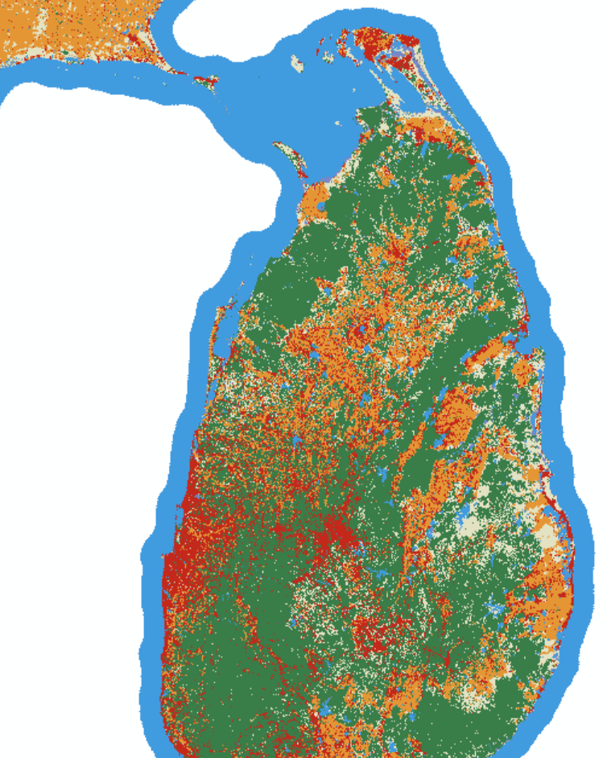
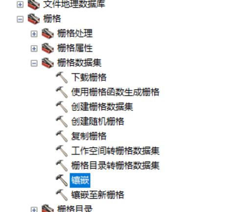
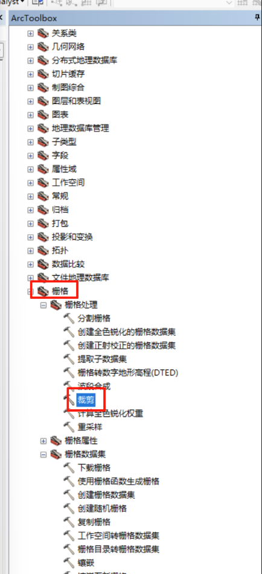
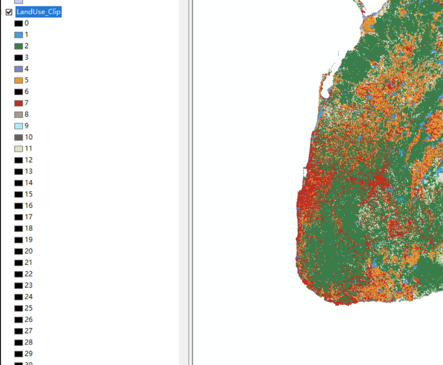
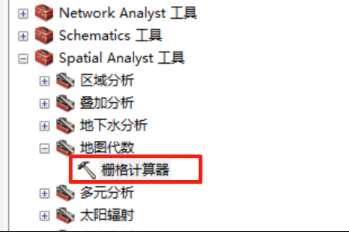

## 7月

好久没记录了啊。

其实每天的生活都不太需要记录。

我们浅浅的回忆一下大事件。

---

**7月10-7月16**

这个事件段的大事件主要是：

+ 搬去奥运村了。完成了行李整顿
+ 回所了，主要工作内容就是处理原先的`物探+遥感融合`，计算`ESV`
+ 出去租房子
+ 买了两只仓鼠

**7月17-7月23**

+ 学习了如何用`docsify`创建`ebook`并部署
+ 学习了`gee`以及`gmap`
+ 自行车被偷了，买了辆捷安特
+ 放暑假了咯

**7月24-7月30**

+ 宿舍摆烂
+ 玩尘白禁区和莱莎三
+ 家里空调遥控器坏了，热死了，整得我去网吧通宵了一宿，遇到个大哥，扯近乎想趁我睡觉玩我的机子....有病吧
+ 27号去丰泽园跟郭思阳吃饭了。花了三百多，吃了北京烤鸭，九转大肠，干炸丸子。他之前跑西藏去了，之后去青海。

----

上午九点半起的，出去买了coffee和早餐。吃了coffee后状态明显不对了。现在的状态也不是很对啊喂。很难受，跟之前一样。会不会还是太迟睡了？反正没睡够是不信的。

中午点菜，结果送错了。找美团协商退款，又点了kfc。

上午...看了下神经电位传播。关于这个，有一些好玩的，比如空间常数、时间常数，电阻电容，郎飞结跳跃传导点火等等。

中午看gh下饭，一直看到了三点，状态还是不对。今天北京特大暴雨，杜苏芮到安徽了好像？屋子也漏水了。啊还有就是，上午本来想找赖秋瑶去玩的，但是自己有太胖了，她也要去厦门玩，好吧。

下午，下午在干啥？？

看洪兰老师的脑科学，晚上实际上也在看。然后买了KE简中版本。

嘛不过洪兰老师讲的一些内容我都忘了。

印象比较深的就是睡眠的波段，睡眠对记忆的固化，神经修复作用。还有运动产生的神经滋养因子，零时运动测试会大大提高记忆。

根据脑科学的研究，神经回路的分布形态虽然是天生的，但可以改变密度。这就需要后天训练，用进废退。

运动强化神经单元，不仅仅是产生大量的血清素和内啡肽，还能分泌神经滋养物质。

睡眠分为四个阶段，前两个阶段是theta波，后两个阶段是delta波，入睡是beta波，清醒是alpha波，前半段快速眼动阶段是在固化记忆，后半段是在修复神经？

睡眠是一定会做梦的，做梦可以把一整天的事情清空。除却睡眠，碳水也可以提高脑细胞活性，提供营养。

---

# 8月

> 艳阳时节又蹉跎，迟暮光阴复若何

**8月1-8月7**

一号在思考人生意义。二号也是。二号看了一个视频，说实话我自己没点进去看，但是是关于一个`觉醒`青年的，98年赚了一个亿。有些许感触，有些人比较赚大钱，但是我不太适合。如果我什么都想要，什么都要跟别人比，那不就完蛋啦？

嗯，这个栏目不是写感悟的，还是说说发生了啥吧。

8月2号去走访了一些健身房，主要是乐刻和锐。乐刻场地较小，器械较少，空间密，我不太喜欢，但胜在便捷，二十四小时+连锁，很方便。锐的话，环境没的说，五颗星，旁边还有游泳馆，一年2700。

8月3号搬家，上午加钱加到60才有人接，路上跟司机聊天，当然这个不重要。老鼠放在四楼了。到了宿舍收拾了下，十一点二十多了，然后跑所里放电脑。但是发现身份证不见了。于是跑去清河派出所办理。期间发生了一些不愉快的事情，譬如充电宝放到了未充电的充电桩内，叫鲲鲸云，很麻烦。下次就知道一定不能这样做了。补拍身份证，很丑......说实话我一直有容貌焦虑和身材焦虑，非常不自信。哎？反正下午办理了很久。到八月二十三去取就行了。晚上的话，看了电影封神。没带啥脑子去看的，感觉一般。然后过夜在研究所过得夜，被蚊子咬死了。

8月4号早上回宿舍补觉，中午十二点半师兄回来了。下午去清河万象汇，本来想去西西弗的，但是人好多，看了看周围自习店的价格，还是望而却步了。其他没啥好说的，这一天没做什么，但是很困很困。看到LK99失败了，很正常。中图网受到极端降水影响损失80%的书籍，可见这次百年大暴雨的破坏性。晚上做啥了吗？晚上来写这个日记来了。现在差不多啦，我还是想坚持一下下，尽管很没意义。现在身上欠款五千，在之前可能会疯掉吧，这些钱都怎么花的？现在每天要开始记账了，然后记录体重。诶嘿，我更新了下我的blog。

8月5号。昨天因为鼻炎很难入睡。两点的时候www还跟我打电话....只能说很逆天。中午想去西西弗，但是转念一想，还是去附近的图书馆算了，于是第一个目的地选择新华书店百年书店，但是我想先吃个饭，就去逛了逛天虹市场，挺小的，但是人很多。旁边的是新奥中心。中午跑到亚运村吃肯德基，旁边有一家汤泉良子，有点想去泡温泉，不过还是减肥减下来再说吧。最近两家书店，一个在亚投行，一个在党史馆，想了想还是没去。两点多回家，学长在睡觉。他跟我说他晚上不咋回来。下午摆烂，背完单词，六点钟出来吃饭。吃完饭在乐刻运动到七点五十，想去练乒乓球。八点二十回来了，看LPL夏决。说实话没做什么事情。

---

8月13日，自行车刹车右刹车坏了，买来还不到一个月，链条也有点问题。估计是那场大雨导致的。书包坏了，所以换了个新的。买来的自行车锁链也有问题，六十块钱的东西果然不好用。眼镜有问题，一只清晰一只模糊，看东西头晕。太胖了，要减肥，狠狠地减肥。以后不能吃肯德基了。什么东西都没做，就这样吧。

---

815。已经上班第二天了。

要说做了什么，昨天晚上三点多睡的，今天困得不行。上午的话，就是尝试获取了Sri Lanka的Land Cover图，并且在GADM上获取了shp三级边界图。做了个图像镶嵌(mosaic)，然后做了个按矢量边界裁剪，具体内容如下：

如何合并两个栅格图？

先思考一下，应该用镶嵌工具，那么在哪？

哦在这宝贝，$数据管理\to栅格\to栅格数据集\to镶嵌$。

裁剪也在旁边哦

裁剪完后出现这种情况应该怎么处理？

率先想到的是重分类，但是基本的重分类要全部点掉....算了还是先做栅格运算吧。

工作是利用条件函数`con`，`con(A>x,1,0)`，满足条件取1，不满足取0。

然后做完这件事前后，还跑去厕所摸鱼了一会。今天朱老师没来，患了手足口。再然后，我在找Sri Lanka的作物数据，找到了他们的官方网站，但是数据不好。斯里兰卡讲僧伽罗语。他们的季节有两个，一个是马哈，一个是雅拉。此外，yield 是产量的意思。

之后找到一个联合国粮农组织数据库，在这里获得了斯里兰卡主要谷物的平均价值(本币/吨)，以及生产平均产量(0.1kg/公顷)，一公顷等于0.01平方千米，等于10000$m^2$

上午就差不多到这了。主要是数据收集。

中午吃的肯德基。。。。

两点钟回来，干啥呢？验证了数据的单位，现在有产量表和价值表，理论上可以开展工作了。

但是我想收集NDVI、Temperature、RainFall数据，这个数据在哪找呢？`GEE`。现学现用嘛不是！

于是就经历了比较痛苦的debug过程，期间还跑去厕所摸鱼、刷知乎。终于！我搞明白了其中的逻辑！知道了如何处理、导出栅格数据，并且复习了一会如何操作GEE。晚上很困很痛苦，摸鱼到二十点半，然后去健身，跑了两公里，上肢锻炼做了几组。好累。

回来跟隔壁的师兄 陈元琳 加了好友，交了电费。洗了澡，洗了衣服，写了一大堆废话。

本来打算整一个Pyechart六维图，结果ChatGPT崩掉了。

那就算了，等等复盘一下今天就去睡觉了。

---

