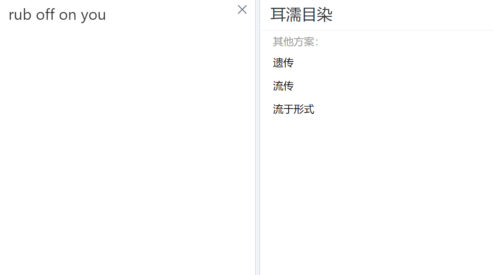

# 7月

好久没记录了啊。

其实每天的生活都不太需要记录。

我们浅浅的回忆一下大事件。

---

**7月10-7月16**

这个事件段的大事件主要是：

+ 搬去奥运村了。完成了行李整顿
+ 回所了，主要工作内容就是处理原先的`物探+遥感融合`，计算`ESV`
+ 出去租房子
+ 买了两只仓鼠

**7月17-7月23**

+ 学习了如何用`docsify`创建`ebook`并部署
+ 学习了`gee`以及`gmap`
+ 自行车被偷了，买了辆捷安特
+ 放暑假了咯

**7月24-7月30**

+ 宿舍摆烂
+ 玩尘白禁区和莱莎三
+ 家里空调遥控器坏了，热死了，整得我去网吧通宵了一宿，遇到个大哥，扯近乎想趁我睡觉玩我的机子....有病吧
+ 27号去丰泽园跟郭思阳吃饭了。花了三百多，吃了北京烤鸭，九转大肠，干炸丸子。他之前跑西藏去了，之后去青海。

----

上午九点半起的，出去买了coffee和早餐。吃了coffee后状态明显不对了。现在的状态也不是很对啊喂。很难受，跟之前一样。会不会还是太迟睡了？反正没睡够是不信的。

中午点菜，结果送错了。找美团协商退款，又点了kfc。

上午...看了下神经电位传播。关于这个，有一些好玩的，比如空间常数、时间常数，电阻电容，郎飞结跳跃传导点火等等。

中午看gh下饭，一直看到了三点，状态还是不对。今天北京特大暴雨，杜苏芮到安徽了好像？屋子也漏水了。啊还有就是，上午本来想找赖秋瑶去玩的，但是自己有太胖了，她也要去厦门玩，好吧。

下午，下午在干啥？？

看洪兰老师的脑科学，晚上实际上也在看。然后买了KE简中版本。

嘛不过洪兰老师讲的一些内容我都忘了。

印象比较深的就是睡眠的波段，睡眠对记忆的固化，神经修复作用。还有运动产生的神经滋养因子，零时运动测试会大大提高记忆。

根据脑科学的研究，神经回路的分布形态虽然是天生的，但可以改变密度。这就需要后天训练，用进废退。

运动强化神经单元，不仅仅是产生大量的血清素和内啡肽，还能分泌神经滋养物质。

睡眠分为四个阶段，前两个阶段是theta波，后两个阶段是delta波，入睡是beta波，清醒是alpha波，前半段快速眼动阶段是在固化记忆，后半段是在修复神经？

睡眠是一定会做梦的，做梦可以把一整天的事情清空。除却睡眠，碳水也可以提高脑细胞活性，提供营养。

---

# 8月

> 艳阳时节又蹉跎，迟暮光阴复若何

**8月1-8月7**

一号在思考人生意义。二号也是。二号看了一个视频，说实话我自己没点进去看，但是是关于一个`觉醒`青年的，98年赚了一个亿。有些许感触，有些人比较赚大钱，但是我不太适合。如果我什么都想要，什么都要跟别人比，那不就完蛋啦？

嗯，这个栏目不是写感悟的，还是说说发生了啥吧。

8月2号去走访了一些健身房，主要是乐刻和锐。乐刻场地较小，器械较少，空间密，我不太喜欢，但胜在便捷，二十四小时+连锁，很方便。锐的话，环境没的说，五颗星，旁边还有游泳馆，一年2700。

8月3号搬家，上午加钱加到60才有人接，路上跟司机聊天，当然这个不重要。老鼠放在四楼了。到了宿舍收拾了下，十一点二十多了，然后跑所里放电脑。但是发现身份证不见了。于是跑去清河派出所办理。期间发生了一些不愉快的事情，譬如充电宝放到了未充电的充电桩内，叫鲲鲸云，很麻烦。下次就知道一定不能这样做了。补拍身份证，很丑......说实话我一直有容貌焦虑和身材焦虑，非常不自信。哎？反正下午办理了很久。到八月二十三去取就行了。晚上的话，看了电影封神。没带啥脑子去看的，感觉一般。然后过夜在研究所过得夜，被蚊子咬死了。

8月4号早上回宿舍补觉，中午十二点半师兄回来了。下午去清河万象汇，本来想去西西弗的，但是人好多，看了看周围自习店的价格，还是望而却步了。其他没啥好说的，这一天没做什么，但是很困很困。看到LK99失败了，很正常。中图网受到极端降水影响损失80%的书籍，可见这次百年大暴雨的破坏性。晚上做啥了吗？晚上来写这个日记来了。现在差不多啦，我还是想坚持一下下，尽管很没意义。现在身上欠款五千，在之前可能会疯掉吧，这些钱都怎么花的？现在每天要开始记账了，然后记录体重。诶嘿，我更新了下我的blog。

8月5号。昨天因为鼻炎很难入睡。两点的时候www还跟我打电话....只能说很逆天。中午想去西西弗，但是转念一想，还是去附近的图书馆算了，于是第一个目的地选择新华书店百年书店，但是我想先吃个饭，就去逛了逛天虹市场，挺小的，但是人很多。旁边的是新奥中心。中午跑到亚运村吃肯德基，旁边有一家汤泉良子，有点想去泡温泉，不过还是减肥减下来再说吧。最近两家书店，一个在亚投行，一个在党史馆，想了想还是没去。两点多回家，学长在睡觉。他跟我说他晚上不咋回来。下午摆烂，背完单词，六点钟出来吃饭。吃完饭在乐刻运动到七点五十，想去练乒乓球。八点二十回来了，看LPL夏决。说实话没做什么事情。

---

8月13日，自行车刹车右刹车坏了，买来还不到一个月，链条也有点问题。估计是那场大雨导致的。书包坏了，所以换了个新的。买来的自行车锁链也有问题，六十块钱的东西果然不好用。眼镜有问题，一只清晰一只模糊，看东西头晕。太胖了，要减肥，狠狠地减肥。以后不能吃肯德基了。什么东西都没做，就这样吧。

---

815。已经上班第二天了。

要说做了什么，昨天晚上三点多睡的，今天困得不行。上午的话，就是尝试获取了Sri Lanka的Land Cover图，并且在GADM上获取了shp三级边界图。做了个图像镶嵌(mosaic)，然后做了个按矢量边界裁剪，具体内容如下：

如何合并两个栅格图？

先思考一下，应该用镶嵌工具，那么在哪？

哦在这宝贝，$数据管理\to栅格\to栅格数据集\to镶嵌$。

裁剪也在旁边哦

裁剪完后出现这种情况应该怎么处理？

率先想到的是重分类，但是基本的重分类要全部点掉....算了还是先做栅格运算吧。

工作是利用条件函数`con`，`con(A>x,1,0)`，满足条件取1，不满足取0。

然后做完这件事前后，还跑去厕所摸鱼了一会。今天朱老师没来，患了手足口。再然后，我在找Sri Lanka的作物数据，找到了他们的官方网站，但是数据不好。斯里兰卡讲僧伽罗语。他们的季节有两个，一个是马哈，一个是雅拉。此外，yield 是产量的意思。

之后找到一个联合国粮农组织数据库，在这里获得了斯里兰卡主要谷物的平均价值(本币/吨)，以及生产平均产量(0.1kg/公顷)，一公顷等于0.01平方千米，等于10000$m^2$

上午就差不多到这了。主要是数据收集。

中午吃的肯德基。。。。

两点钟回来，干啥呢？验证了数据的单位，现在有产量表和价值表，理论上可以开展工作了。

但是我想收集NDVI、Temperature、RainFall数据，这个数据在哪找呢？`GEE`。现学现用嘛不是！

于是就经历了比较痛苦的debug过程，期间还跑去厕所摸鱼、刷知乎。终于！我搞明白了其中的逻辑！知道了如何处理、导出栅格数据，并且复习了一会如何操作GEE。晚上很困很痛苦，摸鱼到二十点半，然后去健身，跑了两公里，上肢锻炼做了几组。好累。

回来跟隔壁的师兄 陈元琳 加了好友，交了电费。洗了澡，洗了衣服，写了一大堆废话。

本来打算整一个Pyechart六维图，结果ChatGPT崩掉了。

那就算了，等等复盘一下今天就去睡觉了。

---

### 8/21

这个单词有点意思。

出自*IELTS SUPERIOR SPEAKING*

原句为：`The more accurate and complex grammar you are exposed to, the more likely it is that some of it will rub off on you.`

`你接触的语法越准确、越复杂，你就越有可能从中学到一些东西。`

上午边让电脑跑，自己边读这个雅思口语。托福口语是机考，雅思有考官。除却这个外，今天老师问我电脑的情况，我大抵是觉得目前不太需要。

然后依旧非常的`depression`。人活着本来就没有意义，如今我的生活已经脱轨太多太多了，这种感觉很难受，也不是没想过改变和追赶，但是我已经不太行了。

要不就这样吧，越活越痛苦。

运动完心情会变好。确实有助于缓解情绪。

这里三阳了。

中午去吃的牛肉和鸭血，然后顺便看了一篇文章，讲的是，有时候不活，反而会有更好的效果。

有一些比较好的思想，包括 人不应该去符合传统，所谓的传统和常识都在不断的变化，以前正确的，现在未必正确。

感觉是会随着环境改变的，你已经做的很好了，要真正做到正视自己。

负面情绪才是真正趋利避害的本能，一直的乐天派在自然界才是异类。要坦然面对负面情绪。

所谓的正义，也会因为立场和环境的变化而转移。万事没有绝对，避免无意义的争辩和社交。

然后中午去锻炼了，教练指出了我的问题，器械要绷住。

还有的锻炼在晚上进行，就在写文的刚刚。这个日记篇不会涉及过多的工作，主要是生活上的记录。

晚上的话，吃了kfc四块原味鸡，回来玩千年之旅，到二十点开始看视频，想着要不，咱吧图表画一画。结果就到了二十一点半。做完啦，心里蛮开心的。情绪跟上午的完全不一样。很明显，压力是我自己给自己的，现在暂时先不要去接触压力源，peer也好，community也罢，暂时先看点可爱的东西。

还有就是口语听力，一定要练习，要大量训练。

认知觉醒这本书，我之后会专门出个专栏讲讲。

还有我今天看老王讲的为什么中国人会摆，说的挺好的，本质上是`单一价值观`疯狂内卷下的产物。再也没有莎士比亚，没有诗和远方，有的只是无休止的功名利禄。然而，此时的中国已经不像商鞅变法时的大秦，有着足够的上升空间。在经济下行，社会稳定的今天，阶级跃迁难以实现，人民辛苦工作，但薪资水平相较几年前并无改变，甚至失业浪潮一波更甚一波。而物价水平飞涨，炒房热潮，不断加杠杆之下，普通人的日子苦不堪言。负债，负债，负债。人们在债务驱动下前行，市场和政策内驱因子引导着人们的价值观和风向，但在企业转型这个巨大的幌子下，在生活会越来越好的大饼下，有人终于开始喘不过气了。

为何要如此活着？为了债务当牛做马的一辈子，真的有任何的意义和未来可言吗？让子代重复下去？给那些吸血鬼，那些农场主当驴？

没有能力就别生孩子。不懂教育就别养孩子。

劳动定义了人为什么是人？可笑。刻在骨子里的思维钢印。多少人辛辛苦苦的劳动，结果换来的是杠杆不断的累加，换来的是上层的锦衣玉食，换来的是跑车轰鸣，游艇载歌。

上面这三段是我自己的理解，此外，视频提到男人和女人的对立本质上是单元和多元价值观的冲突。

今天老师跟程老师的对话有点意思。

> 这是程老师您的理解，还是文件上的内容？

其他倒没啥好说，晚上接着运动了一会。

---

### 8/22

和气桃桃的蜜桃冰冰茶，好喝!这几天喝的里面算是最好喝的了，不过有可能是我比较喜欢桃子吧。

虽然工作是工作，生活是生活，但是今天的工作是在晚上完成的，所以就记录一下吧。

中午没有去锻炼，回宿舍睡觉了。

有个有意思的事情，西工大的王老师，把项目一拖再拖，本来说今天三点，又拖到九月份了，这些老师真会踢皮球。

啊哈，项目完不成了，上面不给报销，那问题就大了，所以晚上老师很生气。

然后，我说说晚上。本来想直接拿电脑跑路的，结果出去骑车了，今天是七夕，乞巧节。我骑到林翠的那家沙县吃了个鸡腿饭，18。

然后想去网吧，就嗯骑，发现咦不对，在龙岗路，东直门那里，又骑回来了。没有身份证咋上网啊.jpg

回来后点了杯蜜桃冰冰茶，今天骑行总公里数大概在九到十左右。

回去后摆烂，然后整合了PPT，做了个新的模板。

还是挺好看的哈，做了差不多三个小时左右。

其他没事了，今天就这样。哦对了还上传了Github

明天的话，还有一些遗留问题需要归档。

---

### 8/27

去配了眼镜。

再洛克时代B座15A的大奔眼镜。

他们的验光全自动化了，是我见过最完善的。

说我之前的眼镜瞳距有问题，散光过高。

两只眼睛 400 475

换了个依视路的镜片，主要是防疲劳的，1317。

说是看近的地方容易视疲劳，晶状体凸起，但是我这里对刺激变化不敏感，调节能力有问题，晶状体比较扁平。所以看东西累。

今天再群里说自己重度抑郁，有人加我好友。聊了会，然后晚上有人跟我在可话上倒垃圾，做生物分子的，说是小导啥也不干，给她两个横向叫她疯狂做。大家都有难过的地方。

---

### 8/29

00:00
接下东西啊，今天今天是8月29号，我们出发几点钟出发呢，

00:08
早上11点的车，然后唉，10点半我们就出发了，在那之前，早上我思考了一下，

00:17
就我们可能要怎么去做，就未来的那个实验的一个改进方方向啊，

00:24
然后那本欧阳志云的书也到了嘛，老师说，先让我坐下欧阳志云的，

00:30
嗯，这个我们之后再说啊，然后我们不就出发了嘛，出发跟谁呢，嗯，

00:40
跟于老师，呃朱老师，然后我们去那个链家，那个旁边的麦麦田那边接到了聂老师，

00:50
然后我们就出发直接去首都机场啊，然后在路上他们在讲什么呢，

00:57
在讲汽车啊，讲日本的那个阿尔法系列在中国卖140万，但是在日本只需要20万，

01:05
然后讲一下，北京，北京的车是可以合法改装了，就花‎‎三四十‎万，可以把那个内部啊，

01:13
包括那个避震啊，整个车的系统啊，给你改的非常好，这是北京等一下，

01:19
我到到点了个什么东西啊，不就是一个蛋糕吗，一根雪糕还有什么呢，

01:25
没有了啊，不好意思啊，还有什么呢，就是说新一代3.0T 已经没有了，

01:32
现在好像只有2.0混动的系列，当然我车我不是特别懂，然后像什么，

01:38
迈巴赫啊，就说那个迈巴赫的标都是可以自己自己贴的，嗯，再有呢，

01:45
就是什么东西呢，再有就是就说那个司机，他整个大商务就说，比如说拿那个阿尔法，

01:53
他做那个商务的话，在北京起步价是260块钱哇，他说，一年能赚十多万，

01:59
那你让车140多万，一年十多万，嗯干不是不是一个月十多万干12年就回本了嘛，

02:06
对吧啊啊，至于车车车怎么样，但我看到那个呃，聂老师一直都比较感兴趣，

02:17
比较想买这个车啊，当然了，这个东西这个知识，我现在不了解，我也不大想去了解，

02:25
再往后是什么呢，嗯，再往后我们就到了那个机场的时候，机场见到了杨凌，

02:33
杨林老师啊，哈哈哈哈哈哈哈老少北极哎，我们重点讲一下飞机上的所见所闻好不好，

02:42
飞机上几个比较那啥的就是我看那个广告啊，有几个比较好玩的东西，

02:50
嗯，首先就是新新华，新华三新华创还是什么东西，新三华还是什么东西啊，

03:01
反正H 3C 那个东西，新华家，他们是做什么的呢，他们是做一个交换机，

03:09
嗯，一个交换机T o 七好像就是不知道不知道什么叫T o 七，反正有个指数特别低，

03:16
然后可以提升Gpu 的效率，25%哦，不过在那之前，在看那本呃飞机上的那本杂志，

03:26
国航国航的杂志之前，我是看了那个哦，尊享还是什么还是什么尊品，

03:34
就在首都机场那里看的那个东西啊，讲人工智能，人工智能赋权，

03:39
然后什么什么鬼东西的这个都其实都无所谓啊，你说是吧，嗯，这个都无所谓，

03:47
这个东西也就是那样，他就跟他讲一下啊，像什么嗯哦，哦，就是那本书里面的啊，

03:55
中国首富啊，888忘记他叫什么了，但是我那个张一鸣是排，第三，

04:01
就是福建龙岩永定出去的，搞自节跳动的，最近赚了很多钱，马化腾呢，

04:06
至少下降25%，然后再说车上的广告，我至少看到一个新东西就是冷却液做冷却的，

04:16
它是做集群冷却的，就是那个什么，那个时候叫呃，叫曙光曙光3.0，

04:23
做整个冷冷却的啊，整个机房整个集群冷却的这个是第一点，另外一点还有呢，

04:29
就再往下再往下，我们看到另外一个好玩的东西就是是什么呢，

04:34
呃也不算好，玩吧就是等一下啊，冷泉热泉应该是热泉Whole spring 这个东西呃，

04:49
这是一个风景罢了，然后还有什么呢，嗯，那那不不不不啊，还有是就是这个什么国航国航啊，

04:58
中国500强排27还是26，好像很有钱的样子，对吧啊，那提供的是比较好的一个服务方案，

05:07
其实应该还有一些东西，但是我可能都给过滤掉了，我现在主要记得的就这么几个东西了，

05:15
说实话，大晚上也可能酒精，也会阻断你神经链路的一个传输速率，

05:22
所以这个东西呃，咱们按下不表，暂时不逼逼这个东西，然后也没什么好说的，

05:34
然后就到了达州达州通州是吧，人口好像是573，37还573万，

05:43
然后这个GDP 2000多万义还是什么东西，这个地方位于呃，四川的东边，

05:53
离重庆很近，古代从通州是四通八达的意思，然后我们要去的是渠县曲线，

06:02
在这家什么所谓的渠县维也纳酒店在这里入住啊，大厂房豪华大操场哦，

06:10
30610块钱打了只有278，哎，我记这个干嘛呀，这边好好料呢，

06:17
可能就四川的就是一个火锅，但是很辣，那天晚上去吃的就是呃，

06:23
他们这里的一个醉鸡啊，喝醉酒的鸡，然后什么来凤鱼啊，双雕鸡醉鸡，这些东西我们在啊，

06:38
还有喝酒，他们喝酒，我晚上喝了半杯白的2杯3杯3杯啤的，好像哎呀，

06:45
我不知道我确实不太会酒席文化，我确实很多地方做的都不对，

06:51
说实话比较拘谨，真的就是你一个学生在一堆老师里面，你真的很难说，

06:57
做到镇定自若的，就是说能跟他们进行一个交谈，或者说敬酒啊还是什么东西，

07:04
这个东西我真不会，而且说实话，以我的性格来说，我确实我也不喜欢对吧，

07:09
就我包括我自己，我跟我跟我的同学们，然后去做这样的一个事情的时候，

07:14
我都没有没有那个没有说有有互相向同学敬酒啊，还是怎么样的，

07:21
我都没有啊，真的都没有，这个东西，酒席文化还是哦，对对对我想起来了，

07:25
今天看到那个报纸，还有一个听风雨啊哦，不是听风酒，呃听听花酒，

07:31
听花酒，他妈的那个5680还是5281罐叫精装，

07:39
呃不是典藏精装，然后典藏版是5万2800块，谁会花那么多钱买这个说，

07:47
就是说请2个诺贝尔奖来搞什么呃，双维度，还是说什么双重赋能了啊，

07:53
这个东西明显就是在搞怪他们那个东西过来，最多就拍一个宣传片就走了，

07:58
没有人会搞这个东西，此外，此外，此外那个啥嗯，那个什么此外，这个东西啊，

08:08
也就这样吧，我真觉得然后那个老哥说他们那个什么春风生物啊，

08:14
还是春风科技的什么呢，股票赚了130万，不知道哇非常Crazy，

08:18
这个东西啊，真能赚那么多吗，其实也就这样也还好，也还好啊，那我们今天其实也就还好，

08:26
对不对，嗯，吃完饭回来也没干什么，我那个人，我认识那个人那个群里那个叫木的那个同学，

08:33
他妈的他啊，他居然是个研究生，我以为他他的文化程度不高，你知道吗，

08:37
当时跟我讲工资两三一，我就觉得不对劲啊，这个人，可是他还是个研究生，

08:42
我的天呐他他，他的他的，你知道，他的文化水平啊，语言表达能力甚至都不如我，

08:50
我已经很垃圾了，我已经摆烂成这样，他都不如我，你知道吗，真的很搞笑，

08:54
你说现在可能确实是失去了一些思维能力，确实是不好评价，不评判什么东西，

09:00
再往后我们之后说找了一个学妹，那个学妹叫陈杰，陈杰来自中山的，

09:05
然后后面还有一个嗯，他们保研名额还没定下来，还是一个武大的，

09:10
但是武大的，我觉得他不一定会过来，你知道吗，这种情况下就把你割了，

09:14
真的就把你割了，因为他是广撒网的呀，这个我知道我也是搞过这个东西的，

09:19
但是我没有广撒网网，当时一对一的舞蹈单方面就是说除了地大地大，

09:24
那个东西是确实是有点不对劲啊，我确实投了地大，但是也就是这样吧，

09:28
对吧，还有什么东西，还有什么想说的，没有什么想说的Ok，然后就是说刚才那个木木木木，

09:34
他今天晚上让我生了一些事情，就是他妹妹喜欢上他了，我操非常恐怖，

09:38
他妈的他妹妹是抱养的，然后喜欢上了他，他俩都是女的，这东西在中国是不不合法的呀，

09:44
你除非跑到外国去跑到比较开放的地方，比如德国啊，什么瑞士啊，

09:48
那种地方你才有可能对不对，但是他对他们也没有什么感情，所以这件事情也没有什么好说的，

09:56
反正就是这样啊，说什么文武局局长啊，什么杨凌啊，那些什么什么一大堆啊，

10:01
谈天说地啊，扯东扯西的，我觉得没什么必要，对吧，所以呢，明天呢，

10:08
明天就出发啊，我们出发去哪呢，我们出发去称霸遗址啊，嗯，主要做的事情是什么呢，

10:18
主要做的事情可能就是写报告记录一下呃遗址的一个情况可能是我们要做的事情Ok 了，

10:27
那今天就这样咯没什么好说的了。

----

