## 8/16

+ 早上九点十分来的。先吃了口饭，然后复盘昨天的内容并总结。
  + 开小差了，在群里讨论兴趣入门这一概念
+ 十点上了十五分钟厕所。回来将Blog2和这个图标进行了更换
  + 完成了数据清洗，说一下现在的情况，红高粱的数据只到2006年，小米的数据在2005和2020有个长时间的空缺。
  + 肚子有点痛

| TimeStamp |                Event                 |   Flag   | CostTime |
| :-------: | :----------------------------------: | :------: | :------: |
|  10:47-   |          复盘影像裁剪与导出          |    s     |    -     |
|           |            看LK99最近争论            | 没啥结果 |    -     |
|   11:06   |          复盘影像裁剪与导出          |    e     |    19    |
|   11:07   |        查看GEE task tiff进展         |    s     |    -     |
|           | 看了会知乎，程老师叫我下午帮忙拿快递 |    -     |    -     |
|  11：28   |                 摸了                 |    e     |    21    |
|   11:29   |             复盘GEE操作              |    s     |    -     |
|   11:41   |             复盘GEE操作              |    e     |    11    |


好好好，昨天的数据有问题。我重新改一下scale再试试

| TimeStamp |                  Event                   | Flag | CostTime |
| :-------: | :--------------------------------------: | :--: | :------: |
|   14:22   |                  开工!                   |  s   |    -     |
|   14:33   |     修正Temperature，并获得最终结果      |  -   |    11    |
|   15:28   | 困死了，困死了，看完了Asset Manage的部分 |  e   |    55    |
|   15:29   |                 开始记录                 |  s   |    -     |
|   16:05   |                   完成                   |  e   |    36    |
|   16:07   |                   摸鱼                   |  s   |    -     |
|   16:48   |          干活，导出数据文档查看          |  S   |    -     |
|   17:29   |            摸鱼，看缅北割腰子            |      |    1     |


看，这个就是最终结果，并不能很好的匹配，底图是土地利用图，因为采样分辨率的问题，并不能对上。

`hover over ` 悬停

`quota  ` 配额

`more specifically` 更具体的

---

## 8/17

| TimeStamp |                Event                 |   Flag   | CostTime |
| :-------: | :----------------------------------: | :------: | :------: |
|   9:26    |          干活，复习昨日知识          |    s     |    -     |
|           |          学习GEE IMPORT操作          | 没啥结果 |    -     |
|   10:30   |            学习GEE Export            |    e     |    64    |
|   10:31   |                break                 |    s     |    -     |
|           |  静思，想一想为什么学了四年啥也不会  |    -     |    -     |
|  10：47   |                Export                |    s     |    -     |
|  11：14   | 准备跟进一下Global Forest Change项目 |    s     |    27    |
|   11:41   |             复盘GEE操作              |    e     |    11    |


+ `specify` n. 指定xxx
+ `To sum up`，总而言之
+ `subtly misleading` 隐晦误导
+ `As a shortcut` 作为捷径
+ `duplicate` 重复的

请注意，导出地图瓦片、BigQuery和提取图像数据编程并没有记录。

| TimeStamp  |                        Event                         | Flag | CostTime |
| :--------: | :--------------------------------------------------: | :--: | :------: |
|   14：49   |              摸鱼回来了，摸了50分钟知乎              |  s   |    -     |
|   14：49   |                看一看实验接下来的方向                |  s   |          |
|   15:20    |  修改了原始的土地利用Label，根据谢高地表做了张新表   |  -   |    -     |
|   15:40    | 看文献，大致知道ESV咋算了，并且更新了Lattics工作记录 |  s   |    -     |
|   16:13    |                 摸鱼。并开始整个小活                 |  -   |    -     |
|   16:30    |  看看我的CSDN博客，有些感慨。还有人催更，可惜我现在  |      |          |
|            |                        整大活                        |  s   |    27    |
|   19:40    |                        整大活                        |  e   |    11    |
|   21:00    |               不整活了，边训练边刷视频               |      |          |
|   23:00    |           回宿舍，为啥一定要花时间刷视频？           |      |          |
| 23:00-2:00 |             洗澡，为陈聿为提诗？？我有毒             |      |          |


复现了之前的LSTM，之前的代码带有池化.....LOSS只能到1500

删掉池化后，LOSS到了52.池化问题特别大，一维卷积凭啥用池化啊？

300次后，甚至有0.0002的LOSS。。。。

我现在再加上bn层看看吧。

结果不是很好，估计是我把卷积换成了全连接。奇了怪了。

又换回来了，现在是卷积+BN+RELU，很正常的组合

效果不稳定。

还是换成之前的吧

> 训练时希望每个通道有超过 1 个值，得到输入大小 torch.Size([1, 64, 1])

出现了这样的错误，原因在于样本太小了一个人为啥要标准化。好吧，那就不用。

搞错了...原先的输出LOSS是最后一位，现在改成平均了。

```python
import pandas as pd
import torch
import torch.nn as nn
from torch.utils.data import DataLoader,Dataset
import alive_progress
import torch.nn.functional as F
from pyecharts.charts import *
from pyecharts import options as opts
from pyecharts.globals import CurrentConfig

path=r"E:\科研\ESV计算\Sri Lanka"
yield_c=pd.read_csv(path+r"\yield_c.csv")
pp_c=pd.read_csv(path+r"\producerPrices_c.csv")
yield_c[yield_c["Year"]>2015].groupby('Item').mean()
x=pp_c[pp_c['Item']=="Maize (corn)"]['Value']
x=torch.FloatTensor(x).view(-1)

windows_size=4
# 设置迭代器
class MyDataSet(Dataset):
    def __init__(self,seq,ws=4):
        self.ori=[i for i in seq[:ws]]
        self.label=[i for i in seq[ws:]]
        self.reset()
        self.ws=ws

    def set(self,dpi):
        self.x.append(dpi)
    def reset(self):
        self.x=self.ori[:]
    def get(self,idx):
        return self.x[idx:idx+self.ws],self.label[idx]
    def __len__(self):
        return len(self.x)
train_data=MyDataSet(x,windows_size)

class Net5(nn.Module):
    def __init__(self,in_features=54,n_hidden1=54,n_hidden2=256,n_hidden3=512,out_features=7):
        super(Net5, self).__init__()
        self.flatten=nn.Flatten()
        self.hidden1=nn.Sequential(
            nn.Linear(in_features,n_hidden1,False),
            nn.BatchNorm1d(n_hidden1),
            nn.ReLU()
        )
        self.hidden2=nn.Sequential(
            nn.Linear(in_features,n_hidden2),
            nn.BatchNorm1d(n_hidden2),
            nn.ReLU()
        )
        self.hidden3=nn.Sequential(
            nn.Linear(n_hidden2,n_hidden2),
            nn.BatchNorm1d(n_hidden2),
            nn.ReLU()
        )
        self.hidden4=nn.Sequential(
            nn.Linear(n_hidden2,n_hidden3),
            nn.BatchNorm1d(n_hidden3),
            nn.ReLU(),

        )
        self.out=nn.Sequential(nn.Linear(n_hidden3,out_features))

    def forward(self,x):
        x=self.flatten(x)
        x1=self.hidden1(x)
        x2=self.hidden2(x+x1)
        x3=self.hidden3(x2)
        o=self.hidden4(x3+x2)
        return F.softmax(self.out(o),dim=1)


class CNN(nn.Module):
    def __init__(self, output_dim=1):
        super(CNN, self).__init__()
        self.relu = nn.ReLU(inplace=True)
        self.conv1 = nn.Conv1d(4, 64, 1)
        self.lr = nn.LeakyReLU(inplace=True)
        self.conv2 = nn.Conv1d(64, 128, 1)

        self.bn1, self.bn2 = nn.BatchNorm1d(64), nn.BatchNorm1d(128)
        self.bn3, self.bn4 = nn.BatchNorm1d(1024), nn.BatchNorm1d(128)
        self.flatten = nn.Flatten()
        self.lstm1 = nn.LSTM(128, 1024)
        self.lstm2 = nn.LSTM(1024, 256)
        self.lstm3=nn.LSTM(256,512)
        self.fc = nn.Linear(512, 512)
        self.fc4=nn.Linear(512,256)
        self.fc1 = nn.Linear(256, 64)
        self.fc3 = nn.Linear(64, output_dim)

    @staticmethod
    def reS(x):
        return x.reshape(-1, x.shape[-1], x.shape[-2])

    def forward(self, x):
        x = self.reS(x)
        x = self.conv1(x)  # torch.Size([1, 64, 1])
        x = self.lr(x)

        x = self.conv2(x)  # torch.Size([1, 128, 32])
        x = self.lr(x)

        # x = self.conv3(x)  # torch.Size([32, 300, 298])
        # x = self.maxpool3(x)  # torch.Size([32, 300, 100])
        x = self.flatten(x)
        # 注意Flatten层后输出为(N×T,C_new)，需要转换成(N,T,C_new)

        # LSTM部分
        x, h = self.lstm1(x)
        x, h = self.lstm2(x)
        x,h=self.lstm3(x)
        # 注意这里只使用隐层的输出
        x, _ = h

        x = self.fc(x.reshape(-1, ))
        x = self.relu(x)
        x = self.fc4(x)
        x = self.relu(x)
        x = self.fc1(x)
        x = self.relu(x)
        x = self.fc3(x)

        return x

def Train(model,train_data,seed=1):
    device="cuda" if torch.cuda.is_available() else "cpu"
    model=model.to(device)
    Mloss=100000
    path=r"E:\科研\ESV计算\Sri Lanka\Train\MODEL_\%s.pth"%seed
    # 设置损失函数,这里使用的是均方误差损失
    criterion = nn.MSELoss()
    # 设置优化函数和学习率lr
    optimizer=torch.optim.Adam(model.parameters(),lr=1e-5,betas=(0.9,0.99),
                               eps=1e-07,weight_decay=0)
    # 设置训练周期
    epochs = 10000
    criterion=criterion.to(device)
    model.train()
    for epoch in range(epochs):
        total_loss=0

        for i in range(len(x)-4):
            # 每次更新参数前都梯度归零和初始化
            seq,y_train=train_data.get(i)
            seq,y_train=torch.FloatTensor(seq),torch.FloatTensor([y_train])
            seq=seq.unsqueeze(dim=0)
            seq,y_train=seq.to(device),y_train.to(device)

            optimizer.zero_grad()
            # 注意这里要对样本进行reshape，
            # 转换成conv1d的input size（batch size, channel, series length）
            y_pred = model(seq)
            loss = criterion(y_pred, y_train)
            loss.backward()
            train_data.set(y_pred.to("cpu").item())
            optimizer.step()
            total_loss+=loss

        train_data.reset()
        if total_loss.tolist()<Mloss:
            Mloss=total_loss.tolist()
            torch.save(model.state_dict(),path)
            print("Saving")
        print(f'Epoch: {epoch+1:2} Mean Loss: {total_loss.tolist()/len(train_data):10.8f}')
    return model

A=CNN()
Train(A,train_data,"CNN_1")

checkpoint=torch.load(r"E:\科研\ESV计算\Sri Lanka\Train\MODEL_\CNN_1.pth")
A.load_state_dict(checkpoint)
A.to("cpu")

print(A(torch.FloatTensor([[14.65,18.11,19.54,21.27]])))


pre,ppre=[i.item() for i in x[:4]],[]
for i in range(len(x)-3):
    ppre.append(A(torch.FloatTensor(x[i:i+4]).unsqueeze(dim=0)))
    pre.append(A(torch.FloatTensor(pre[-4:]).unsqueeze(dim=0)).item())
l=Line()
l.add_xaxis([i for i in range(len(x))])
l.add_yaxis("Original Data",x.tolist())
l.add_yaxis("Pred Data(Using Raw Datas)",x[:4].tolist()+[i.item() for i in ppre])
l.add_yaxis("Pred Data(Using Pred Datas)",x[:4].tolist()+pre)
l.set_series_opts(label_opts=opts.LabelOpts(is_show=False))
l.set_global_opts(title_opts=opts.TitleOpts(title='LSTM CNN')
                            
                             )

l.render_notebook()
```


只靠学习自己的，似乎并不能取得更好的结果。

所以我们要改变训练思路。


其实分析上面的结果，我们可以发现LSTM的波动要比CNN好，CNN后面死水一潭，应该是梯度消失导致的，前面信息没有了，后面信息又是自个构造的，这就导致了到后面变成了线性情况。

后面窗口大小改成6了，效果好多了。现在就是，将其归档吧，要不发篇blog吧，好久没发了。


---

## 818

| TimeStamp |                            Event                             | Flag | CostTime |
| :-------: | :----------------------------------------------------------: | :--: | :------: |
|   9:10    |                          醒了，好困                          |  s   |    -     |
|   9:40    |                    摸鱼，看到了世界的参差                    |  -   |    -     |
|   9:50    |           修正了昨天的结果，更换了窗口，完善了代码           |  -   |    -     |
|  11：10   | 得到了较好的结果，中间很累，大脑混乱什么都想不起来，又depression了 |  -   |    -     |
|   11:30   | 摸鱼，打算写一篇Blog，下午的工作就是Blog+GEE生态环境变化吧，中午去报修一下电表？ |  -   |    -     |
|   11:34   |                           总结下吧                           |      |          |
|  11：14   |             准备跟进一下Global Forest Change项目             |  s   |    27    |
|   11:41   |                         复盘GEE操作                          |  e   |    11    |

现在又有一点问题。

我选择了窗口5对小米进行计算。很可惜的是，最终结果与官方数据相去甚远。甚至官方本身的结果也是跳变，纳闷。

、

官方价格在一年翻了一倍。牛逼。

那就不要用小米了？算了我不想浪费，官方这个，产量增加30%,价格增加100%，这符合市场规律吗？

周五下午摆烂。无所谓，又Depression了。

然后就是打算写一篇Blog。外加下数据了。

晚上健身去了。然后点了茶话弄他们家的南山烟雨、芊芊绿雪 还可以，都是茶

---

## 8/21

说起来，好像把工作和日常弄混了。

早上，到11点为止，终于是把2017-2022的数据处理好了。本身并没有什么难度，主要是，需要大量的工作时间。

中午电脑出了问题，在找解决方案。

下午通过模型迭代器按照区域进行裁剪了，这个值得记一下：


在这里打开。数据、工具全部都是所见即所得的，可以直接拖进去。

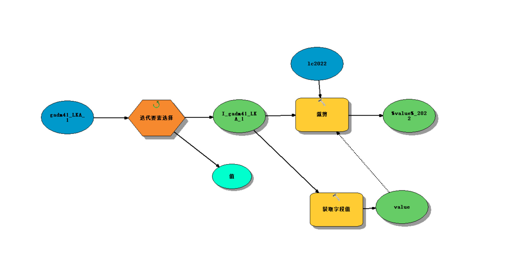


这里可以创建连接。获取中间变量，则是通过`%%`来进行。


这里可以清空缓存。

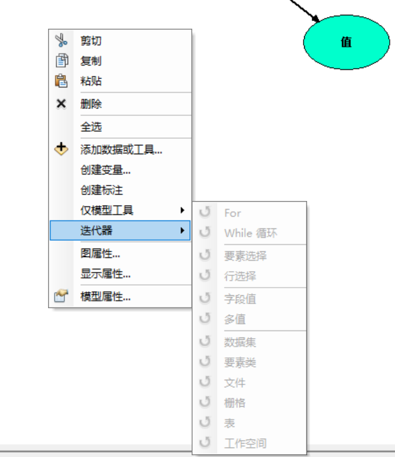

右键可以插入迭代器。

然后批量完成了17-22的拆分，并通过唯一值分类构建属性表和色带。

下一部分的工作，就是导出属性表并进行最终的计算和统计。

在完成唯一值分类后，通过数据处理完成了最后的收尾工作。

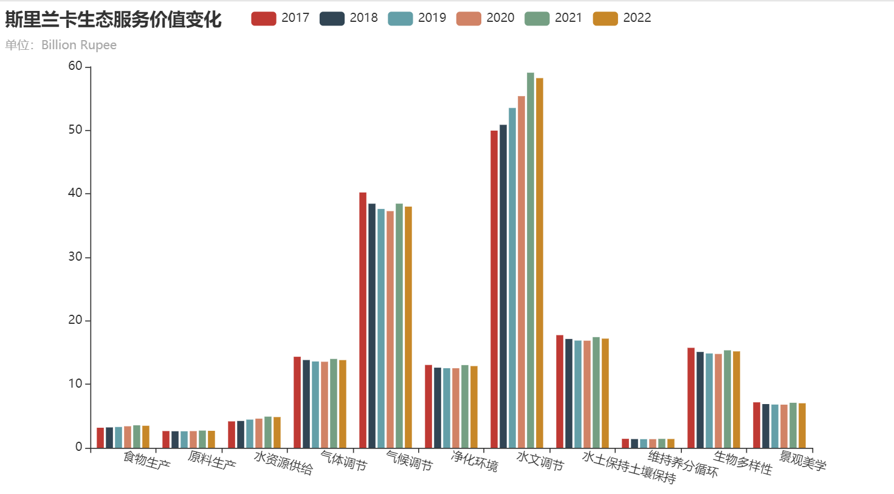


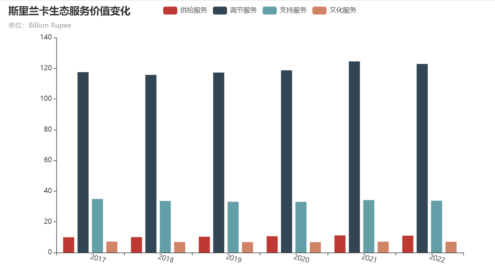

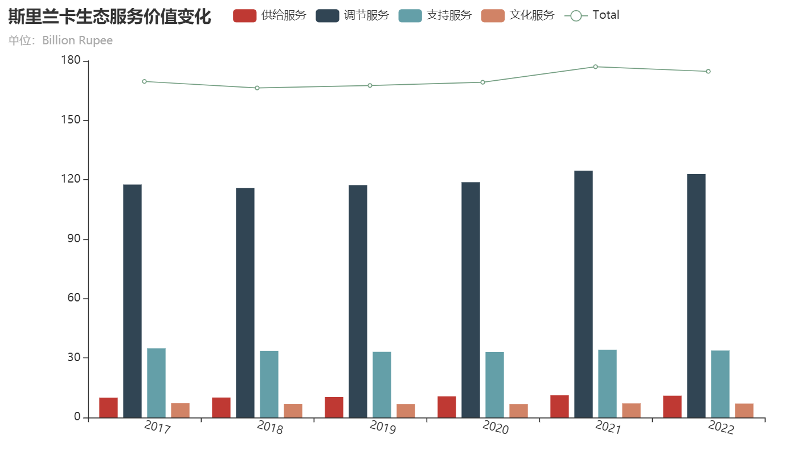

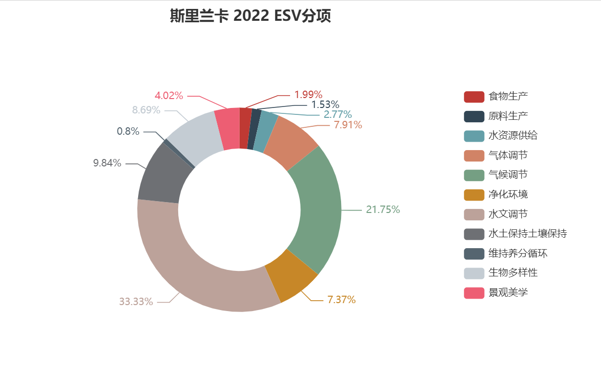

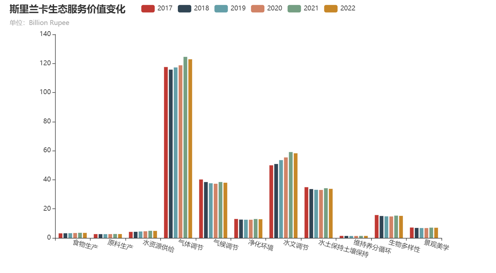

---

## 8/22

> Target

- [x] 完成2017-2021年各省份属性表的导出 
- [x] 完成各省ESV的计算
- [x] 制作年份动态图
- [x] 代码、数据归档
- [x] 完成总结报告

- [x] 完成一份PPT说明

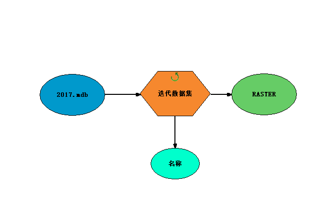

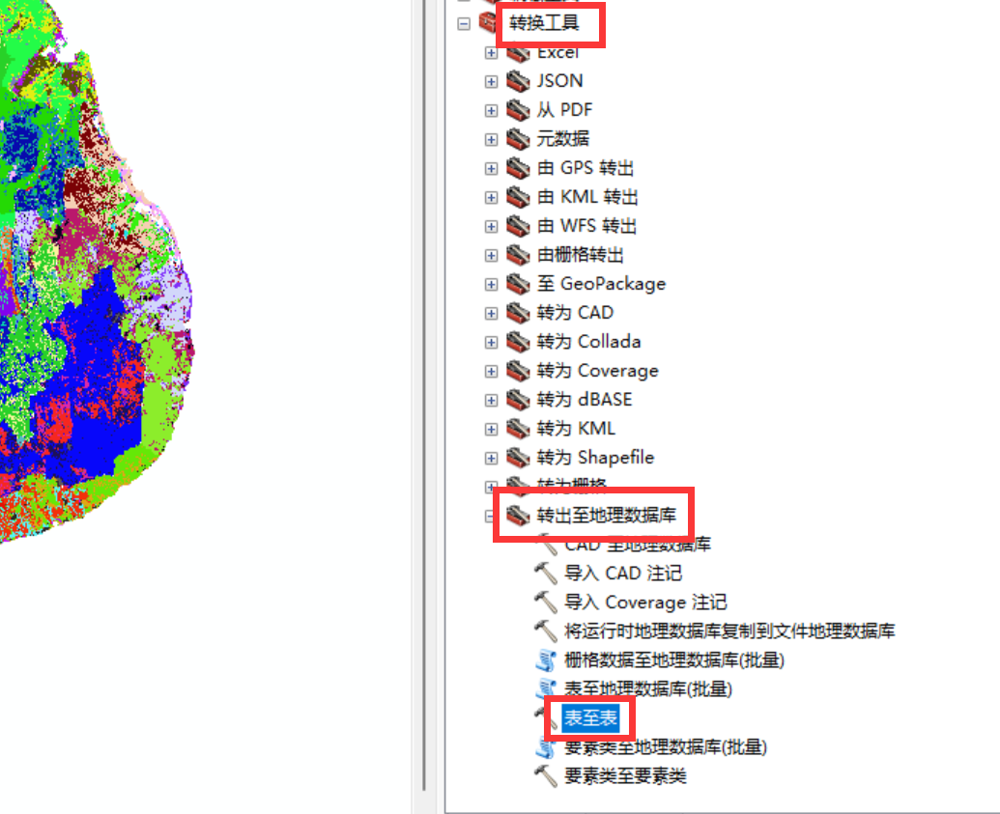

其实做这个项目学到了一些东西，最主要的还是模型构建器的使用。在之前我都没用过，这次算是扫盲了。

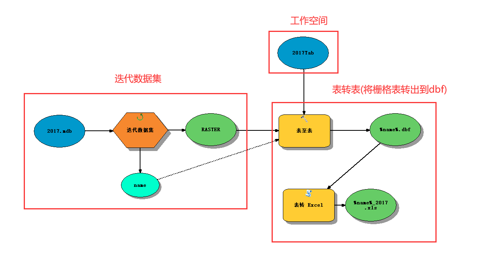

Tabs里面的是

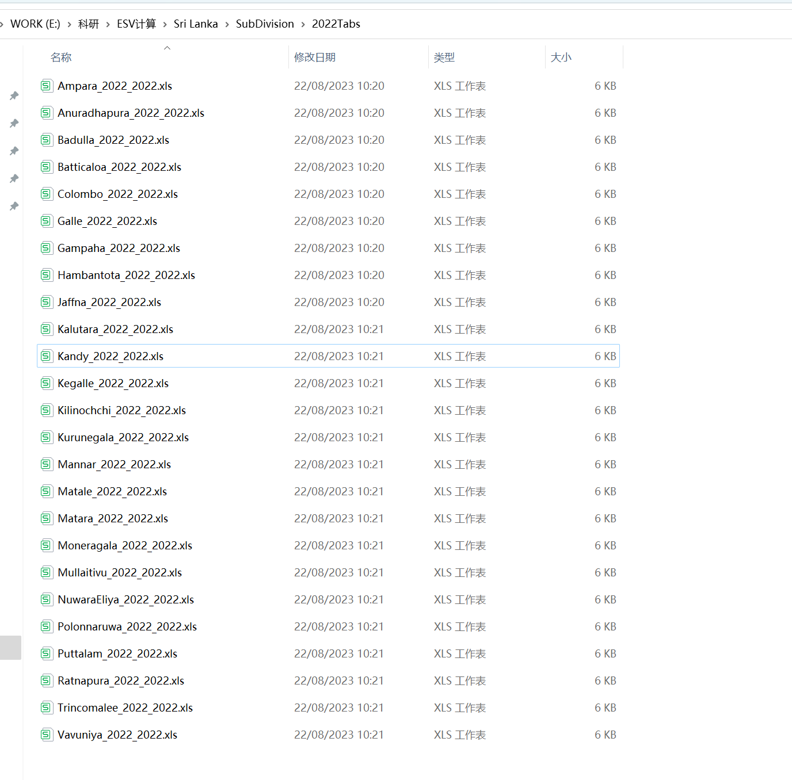

Tab里面的是

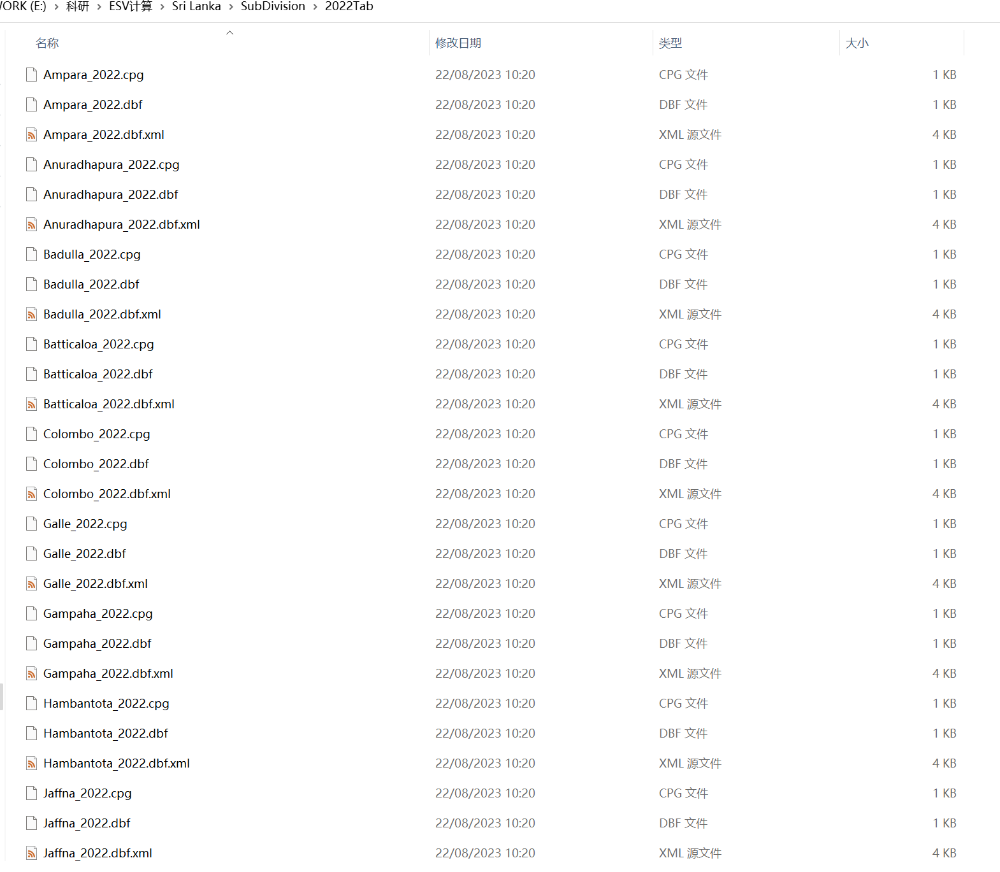

实际上在做分割的时候，不可避免的会丢失一些栅格信息：

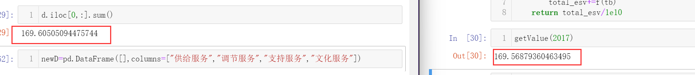

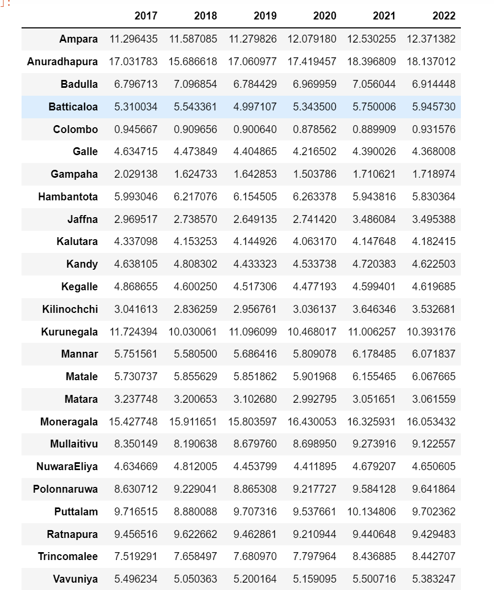

所以这是最终结果。

下面是可视化阶段，我想要在地图上进行。

基于自然断点法，分为五类：

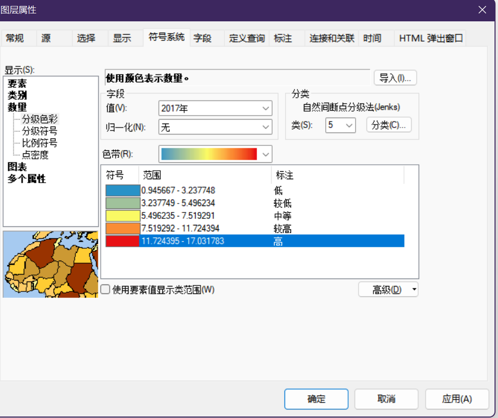

但这样看不出来变化。

那就： 3 6 9 12 12+

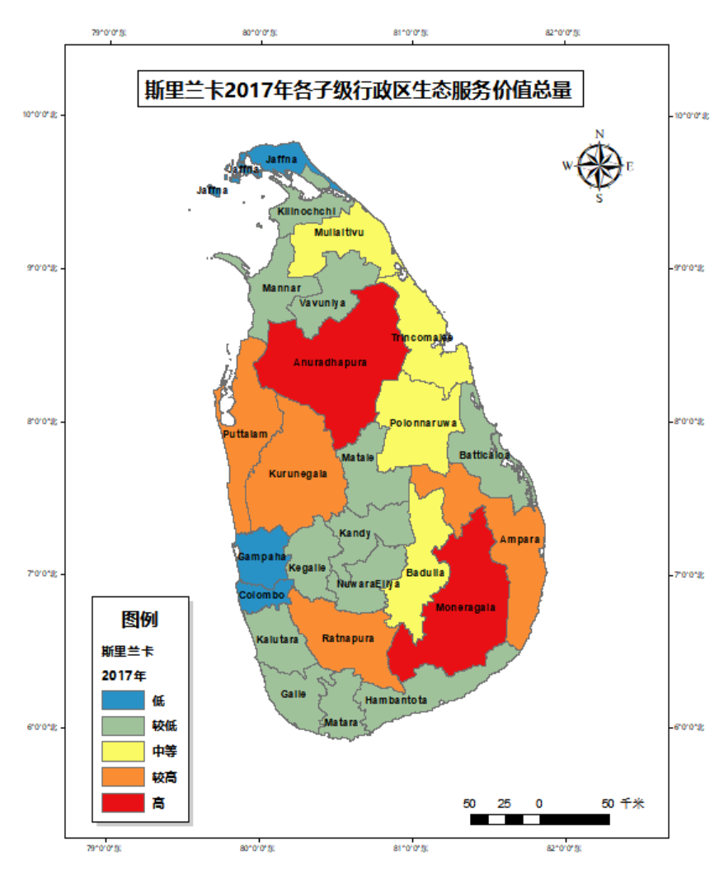

---

## 8/23

> Target

- [ ] 复盘昨日
- [ ] 归档
- [ ] GEE Global Forest Change

---

## 8/24

|  TimeStamp  |                            Event                             | Flag | CostTime |
| :---------: | :----------------------------------------------------------: | :--: | :------: |
|    9:10     |                  跟了一下时事，日本福岛排海                  |  s   |    -     |
|    9:40     | 中午十二点排，目前没有什么感触，多半是我早就盼望着死了。但是，如果死去是痛苦的，是在病床上呻吟着死去，那并非我所愿。普通人的工作自是无用的，所有的抵制工作，最终都不过是经济制裁罢了。当核污染水排放的那一刹，做什么都于事无补了。毫无疑问，地球的水循环体系将把这些污染带到世界各处，并不仅是海洋生境的破坏，并不仅是无法吃上海鲜，海洋生物被侵蚀消融这般，而是对所有的林地，所有的土壤，所有的农作物，都将造成不可估量的损害。辐射能源是清洁能源吗？如此高风险的能源，为何没有一套完备的处理体系？日本是觉得自己已经没有下一代了吗？虽然我不关心这些，但第一受害者只会是日本的普通群众。 |  -   |    -     |
|    9:50     |             下周要去成都出差，需要申报一下流程？             |  -   |    -     |
|   11：10    |         怪，上午在找文献，下载文献，现在文献差不多了         |  -   |    -     |
|             |                                                              |      |          |
| 13:00-14:00 | 健身、看文献，本来以为武夷山算错了，没想到1/7实际上应该是美元？ |      |          |
| 14:00-14:23 | 看文献，摸鱼，有个小孩在，好像是老师的小孩...说起来中午的情绪又不太对劲了，跟下雨天有关系吧。晚上也不怎么想吃饭了，直接回去吧，今晚早点睡吧。 |      |          |
|    14:46    | 看了下最近的评论。海关将全面暂停进口日本海产，经济制裁如果大于核污水排放的收益，倒也真有可能停下。此外，部分网友属实是没有一丁点脑子，哪怕是有花生米大的脑仁都不至于像个小丑般被带节奏 |      |          |
|    15:00    |                 今天不太想做什么，先休息一下                 |      |          |
|             |         下午摸了个熵权法，然后基本上把那些论文看完了         |      |          |

---

## 8/25

**任务列表**

- [x] 9:30-9:55 文献阅读
- [ ] 10:00-10:25 文献阅读
- [ ] 10:30-10:55 文献阅读
- [ ] 11:00-11:25 总结与反思
- [ ] 11:30-11:55 总结与反思，英语单词前两天复习。


assessment 评估

Terminology 术语

earmarked 专用

effluent 高效

deplete 耗尽

bequest 遗产


---

## 8/28

看文献

整理成xmind

看了下优化算法如何在生态服务价值中气嘴用

看了下如何用GEE获取降水数据，然后就转到了如何用深度学习处理遥感数据，当然现在还没做。

下午看文献，2：30 左右看到了一个PLUS模型，这个模型基于Markov Chain和地理CA、随机森林整出来了个土地类型预测，并且找到了下载的地址，是地大武汉高性能实验室他们开发的。

看了Kappa系数，以及日本东电宣称超过66%的核污染水超标，该公司自福岛第一核电站泄露时间后，已经债台高筑，连年亏损。

哦知道那个叫做雷达图了，我去整一下。然后学一下Morlan I

尝试着在docsify上渲染pyechart，失败。看到人家的案例，收藏了，大概全部都看了下，知道该怎么做了。

然后把空间自相关又学习了一下，并且归纳到算法库里。现在这个算法库比较有意思了。

---

**Target**

+ 植被覆盖因子
+ 土壤可蚀性因子
+ 坡度坡长因子
+ 降雨侵蚀力
+ 降水量
+ 归一化建筑指数
+ 干度
+ 热度
+ 湿度
+ 人类活动


将这些数据，通过TSNE或者PCA降维(不用NN的原因在于不好解释)，得到一个大概3或者四个主成分哈，然后做这个熵权法确定权重哈？不过好像本身有分量来着？每年反正都不一样。

不对，乘上本身的贡献率，最后等于还原原始矩阵喽，我们要的又不是还原原始矩阵，对，熵权法可以用。


