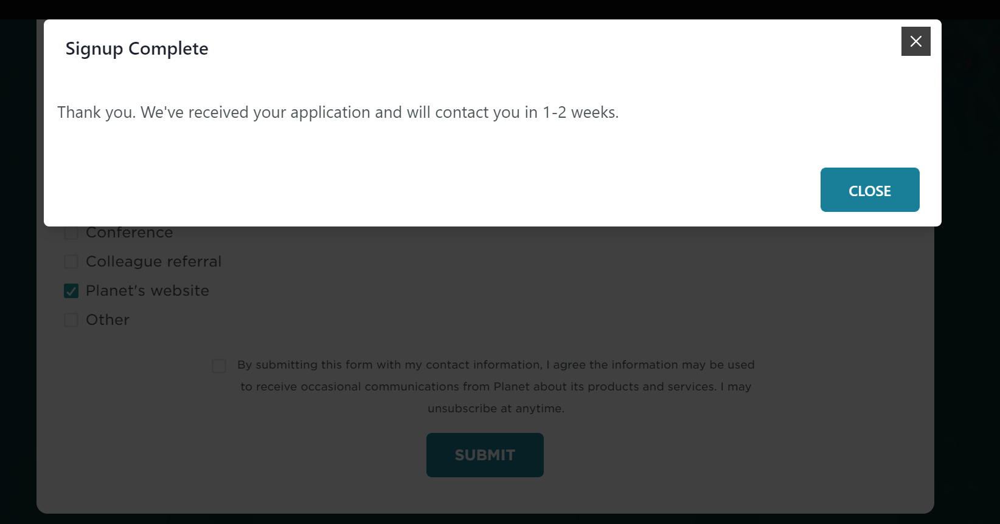

## 9/04

+ 九点到十点 完成了站点录入，选了一些礼物

+ 十点到十一点 找高分数据，发现一个。申请注册ing

  + 

  + 成功了。有个句子：

  + ```
    Describe the project you intend to investigate with Planet data.
    ```

  + 现在续费vpn

  + 好了配置好了

+ 十一点到十一点半 完成了工作组图...奇奇怪怪哈

  + 然后将欧阳志云老师的整理一下吧
  + 没整理到

+ 十一点半之后

  + 找数据，下载了OSM但是转换不成shape

**下午**

+ 十四点到十五点

  + 尝试在ArcGIS中加载数据

  + 刷了会知乎，每次看知乎总会有种空落落的感觉

  + 又再尝试往docsify中嵌入echarts了，主要图表真的好看。

  + html里面可以嵌入另一个html，只需要用：

    ```js
    <iframe src="?" width="100%" height="400" frameborder="0" scrolling="no"></iframe>
    ```

+ 十五点到十五点半

  + 弄好了！我们现在的文档可以显示echart图表啦！
  + 另外，那些点有点问题，可能需要手动调一下。

+ 十五点到十六点半

  + 完成了图表啦，然后是打印反间谍法什么的
  
  十六点半到十七点半
  
  + 完成了反间谍测试啦，那个是什么？无所谓了
  + 看了会知乎，又emo了，我觉得不能看知乎，不能一个人呆着，我现在的状态奇差无比，但是，也没有但是了。就先这样混着吧，也不去跟其他人比较了。
  
  十七点半到十八点
  
  + 完成了专利下载
  
  
  
  ---
  
  ## 九月五号
  
  我在担心什么？
  
  上午找数据找半天，要么不能用，要么分辨率太高了。
  
  看知乎，每次都会心情低落。
  
  三十五就失业，二十五还找不到工作，什么竞赛都没有。
  
  我有什么用？
  
  算了，kaggle还是要做的吧？
  
  真的啊

----

我之前有个工作表？

要不创建一个工作表。

----

## 九月六日

昨天安晴被程老师骂了....有些事情确实不好做捏

|    时间     |                   事件                   | 类型 |       重要性       |            享受度            |
| :---------: | :--------------------------------------: | :--: | :----------------: | :--------------------------: |
|  8:50-9:10  |          工作表格、工作事项修缮          | 杂事 |       :star:       |        :heart::heart:        |
| 9:10-10:00  |      送礼物，看生态系统生产总值计算      | 工作 | :star::star::star: |           :heart:            |
| 10:00-11:00 | 看生态系统服务价值总量计算，外加划水摸鱼 | 工作 | :star::star::star: |           :heart:            |
| 11:00-11:10 |                   冥想                   | 休息 |       :star:       |    :heart::heart::heart:     |
| 11:10-11:40 | 看生态系统服务价值总量计算，外加划水摸鱼 | 工作 | :star::star::star: |           :heart:            |
| 11:40-14:10 |            吃饭、骑车、看老鼠            | 生活 |       :star:       | :heart::heart::heart::heart: |
| 14:10-15:00 | 看生态系统服务价值总量计算，外加划水摸鱼 | 工作 | :star::star::star: |           :heart:            |

```python
He sent it ahead of time.
He sent it ahead.
```

